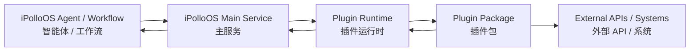
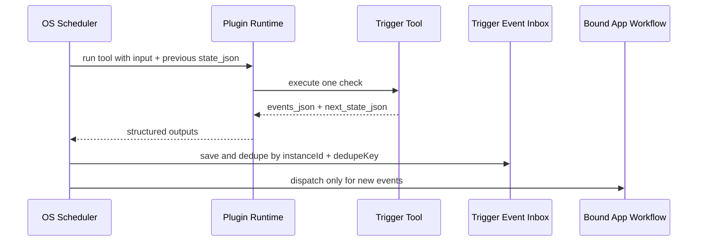

<div align="center">
<a href="https://ipolloos.ai/"></a>

# iPolloOS-plugin

iPolloOS plugin runtime, SDK, and official plugin packages.

iPolloOS 插件运行时、SDK 与官方插件包仓库。
</div>

## What This Repo Is / 这个仓库是什么

iPolloOS-plugin connects external platforms, internal iPolloOS capabilities, and monitoring/event sources to iPolloOS Agents and workflows.

iPolloOS-plugin 负责把外部平台、iPolloOS 内部能力、监控源和事件源接入到 iPolloOS Agent 与工作流。

The repo contains four layers:

本仓库分为四层：

- `runtime/`: standalone plugin runtime service. It loads packaged plugins and exposes tool execution APIs.
- `sdk/`: typed client used by iPolloOS and integration code.
- `modules/tool/`: tool framework, build pipeline, schemas, and plugin packages.
- `modules/model/`: model provider metadata and routing packages.



## Runtime Capability Model / 运行能力模型

iPolloOS plugins declare runtime intent in `config.ts`.

iPolloOS 插件在 `config.ts` 中声明运行意图。

- `execute`: one-shot tool call. Used for search, reading, generation, publishing, updates, and deletes.
- `trigger`: event-source tool. Used for polling checks and webhook normalization. The OS owns scheduling, state, dedupe, event inbox, and workflow dispatch.

- `execute`：一次性工具调用，用于搜索、读取、生成、发布、更新和删除。
- `trigger`：事件源工具，用于轮询检查和 Webhook 标准化。调度、状态、去重、事件收件箱和工作流启动由 OS 负责。

Trigger plugin standard outputs:

触发型插件标准输出：

- `events_json`: JSON array of new events. Each event should contain a stable `dedupeKey`.
- `next_state_json`: JSON state for the next run.
- `summary_markdown`: optional run summary.
- `system_error`: optional machine-readable failure text.



Webhook trigger instances use an OS-generated endpoint, not a plugin-global endpoint:

Webhook 触发实例使用 OS 为每个实例生成的独立地址，而不是插件全局地址：

```text
/api/plugin-triggers/webhook/:instanceId
```

The plugin may normalize webhook payloads into the same `events_json` contract. User subscription and fan-out logic should stay in workflows or business plugins, not in Trigger Core.

插件可以把 Webhook payload 标准化成同样的 `events_json` 协议。用户订阅和分发逻辑应放在工作流或业务插件中，不放进 Trigger Core。

## Package Family Structure / 插件家族结构

Platform plugins should be organized by user workflow, not by raw API endpoint.

平台插件应按用户工作流拆分，而不是按原始 API endpoint 拆分。

```text
modules/tool/packages/{platformName}/
  config.ts                 # parent toolset metadata and shared secrets
  index.ts                  # exports children
  lib/                      # shared client, schemas, formatting, auth
  children/
    querySomething/         # execute/read child
      config.ts
      src/index.ts
    checkSomethingUpdates/  # trigger child
      config.ts
      src/index.ts
    manageSomething/        # execute/write or destructive child
      config.ts
      src/index.ts
  test/
```

Recommended split:

推荐拆分：

- Query/read children: profile lookup, history, search, detail reads.
- Trigger children: polling checks, webhook normalization, cursor/state updates.
- Action children: create, send, publish, update, delete, follow/unfollow.
- Presentation children: HTML pages, cards, dashboards, reports.

## Development / 开发

Install dependencies:

安装依赖：

```bash
bun install
```

Run tests:

运行测试：

```bash
bun run test
```

Build runtime:

构建运行时：

```bash
bun run build:runtime
```

Build marketplace packages:

构建插件包：

```bash
bun run build:pkg
```

Start local runtime:

启动本地插件运行时：

```bash
bun run dev
```

## Publish And Update Flow / 发布与更新流程

1. Update plugin code and `versionList[0].value` when inputs, outputs, behavior, permissions, secrets, or published format changes.
2. Run targeted package tests and runtime/schema tests.
3. Run `bun run build:runtime` and `bun run build:pkg`.
4. Push the plugin repo branch.
5. Import or refresh plugin packages in iPolloOS main service so marketplace metadata and workflow node definitions are updated.
6. Deploy the iPolloOS main service when OS-side contracts or import behavior changed.

1. 当输入、输出、行为、权限、密钥或发布格式变化时，更新插件代码和 `versionList[0].value`。
2. 运行相关插件测试和 runtime/schema 测试。
3. 运行 `bun run build:runtime` 与 `bun run build:pkg`。
4. 推送插件仓库分支。
5. 在 iPolloOS 主服务中导入或刷新插件包，更新市场元数据和工作流节点定义。
6. 如果 OS 侧协议或导入行为变化，部署 iPolloOS 主服务。

## Main Documentation / 主要文档

- [Plugin Framework Architecture and Operations](./docs/plugin-framework.md)
- [Plugin Upgrade Guide](./docs/plugin-upgrade-guide-2026-06.md)
- [Changelog](./CHANGELOG.md)
