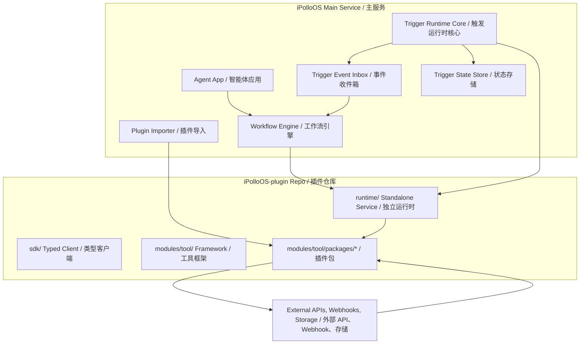
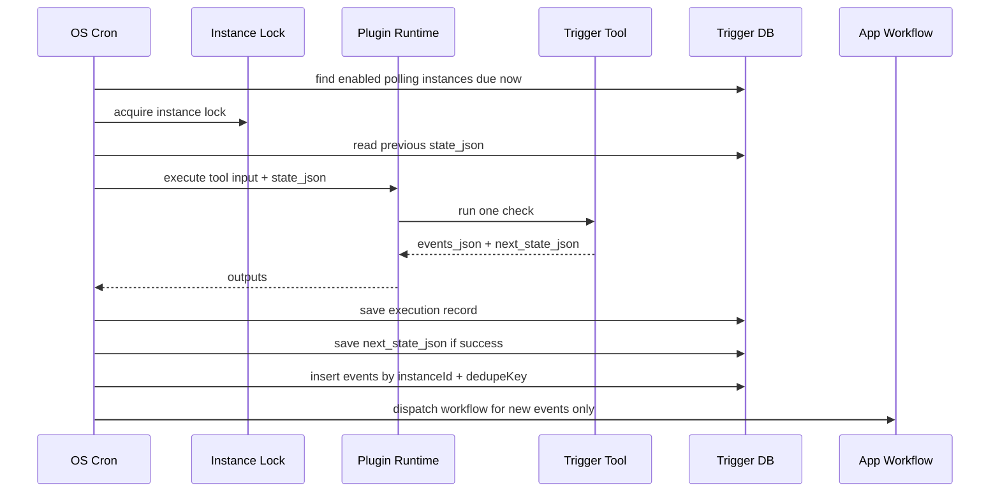
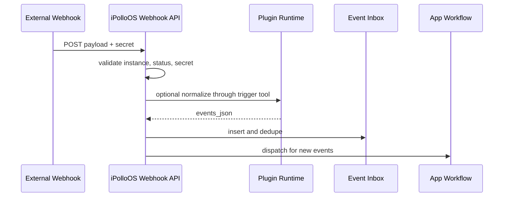

# iPolloOS Plugin Framework Architecture and Operations / 插件框架架构与运作说明

This document is intentionally bilingual in one place. Do not split it into separate Chinese and English files.

本文档刻意采用中英文同页维护。不要再拆成单独中文和英文文件。

## 1. Purpose / 目标

iPolloOS-plugin is the runtime and package system for iPolloOS extensions. It lets Agents and workflows call external systems, use internal iPolloOS services, generate rich outputs, and receive monitoring events.

iPolloOS-plugin 是 iPolloOS 扩展能力的运行时和插件包体系。它让 Agent 和工作流可以调用外部系统、使用 iPolloOS 内部服务、生成富输出，并接收监控事件。

Core boundary:

核心边界：

- Plugin code performs one tool operation.
- Plugin runtime loads packages and executes tools.
- iPolloOS main service owns app/workflow orchestration, plugin import, permissions, trigger instances, state, event dedupe, and dispatch.

- 插件代码执行一次工具操作。
- 插件运行时加载插件包并执行工具。
- iPolloOS 主服务负责 App/工作流编排、插件导入、权限、触发实例、状态、事件去重和分发。

## 2. System Architecture / 系统架构



## 3. Repository Layout / 仓库结构

```text
iPolloOS-plugin/
  runtime/                 # standalone runtime service
  sdk/                     # typed client
  lib/                     # shared runtime helpers
  modules/
    tool/
      type/                # defineTool, schemas, iPolloOS IO types
      build/               # package builder
      packages/            # official tool packages
    model/                 # model provider packages
  docs/
```

插件包推荐结构：

Recommended plugin package shape:

```text
modules/tool/packages/{platformName}/
  config.ts
  index.ts
  package.json
  logo.svg
  lib/
    client.ts
    schemas.ts
    format.ts
  children/
    query_xxx/
      config.ts
      src/index.ts
      index.ts
    check_xxx_updates/
      config.ts
      src/index.ts
      index.ts
  test/
```

## 4. Capability Types / 能力类型

### Execute Runtime / 执行型 Runtime

Use execute runtime for one-shot calls.

执行型 runtime 用于一次性调用。

Examples / 示例：

- read data, search content, query records
- generate images, documents, pages, reports
- send messages, publish posts, update tasks
- delete, revoke, unfollow, or other destructive operations

```typescript
runtime: {
  kind: 'execute',
  execute: {
    riskLevel: 'write',
    requireUserConfirmDefault: true,
    idempotencyKeyInput: 'requestId'
  }
}
```

Risk levels / 风险等级：

- `read`: read-only
- `write`: creates, sends, publishes, or updates
- `destructive`: deletes, revokes, unfollows, or otherwise destroys state

### Trigger Runtime / 触发型 Runtime

Use trigger runtime for polling checks and webhook event intake.

触发型 runtime 用于轮询检查和 Webhook 事件接入。

Important: a trigger plugin does not schedule itself. It exposes a one-check capability. iPolloOS OS creates trigger instances and owns scheduling, state, dedupe, and workflow dispatch.

重点：触发插件不会自己调度自己。它只暴露“一次检查”能力。iPolloOS OS 创建触发实例，并负责调度、状态、去重和工作流启动。

```typescript
runtime: {
  kind: 'trigger',
  trigger: {
    type: 'polling',
    schedule: {
      minIntervalSeconds: 60,
      defaultIntervalSeconds: 300,
      maxIntervalSeconds: 86400,
      timeoutSeconds: 60,
      jitterSeconds: 15
    },
    state: {
      inputKey: 'state_json',
      outputKey: 'next_state_json',
      schemaVersion: 'watch-state.v1',
      cursorKey: 'cursor',
      resettable: true
    },
    event: {
      outputKey: 'events_json',
      schemaVersion: 'watch-event.v1',
      dedupeKey: 'dedupeKey',
      occurredAtKey: 'occurredAt',
      maxBatchEvents: 50
    },
    delivery: {
      retryMaxAttempts: 3,
      retryBackoff: 'exponential',
      failurePolicy: 'keep_state',
      concurrencyKeyInput: 'watchId',
      lockTtlSeconds: 120
    },
    permissions: {
      allowManualRun: true,
      allowAutoRun: true
    }
  }
}
```

Compatibility fields are still accepted for older packages:

旧插件仍兼容以下扁平字段：

- `minIntervalSeconds`
- `defaultIntervalSeconds`
- `maxBatchEvents`
- `outputEventKey`
- `outputStateKey`
- `allowManualRun`
- `allowAutoRun`

## 5. Trigger Operation Flow / 触发运行流程

### Polling / 轮询



No events means no workflow run. The OS only records the execution.

没有新事件时不启动工作流，只记录执行记录。

### Webhook / Webhook

Each webhook trigger instance gets an OS-generated URL:

每个 Webhook 触发实例都有 OS 生成的独立 URL：

```text
/api/plugin-triggers/webhook/:instanceId
```



Webhook addresses are per trigger instance, not per Agent and not per plugin. This keeps multiple apps, teams, and monitoring inputs isolated.

Webhook 地址按触发实例生成，不按 Agent 或插件全局生成。这样可以隔离不同 App、团队和监控输入。

## 6. Event Contract / 事件协议

Trigger tools should return:

触发工具应返回：

```json
{
  "events_json": "[{\"dedupeKey\":\"x-post-123\",\"type\":\"x.post.created\",\"occurredAt\":\"2026-06-24T00:00:00.000Z\",\"payload\":{}}]",
  "next_state_json": "{\"cursor\":\"123\"}",
  "summary_markdown": "Found 1 new event.",
  "system_error": ""
}
```

Event recommendations / 事件建议：

- `dedupeKey`: stable within the trigger instance.
- `type`: namespaced business event type, such as `x.post.created`.
- `occurredAt`: source event time when available.
- `payload`: source-specific data for the workflow.
- Keep payload JSON-safe and avoid secrets.

## 7. Business Fan-out Boundary / 业务分发边界

Trigger Core only brings events into iPolloOS. It does not know user subscriptions, audience lists, or business routing tables.

Trigger Core 只负责事件进入 iPolloOS。它不理解用户订阅、收件人列表或业务路由表。

If an X monitoring event must notify different App users, the bound workflow should:

如果 X 监控事件需要通知不同 App 用户，绑定的工作流应：

1. Read subscription or dynamic table data.
2. Match the event against user filters.
3. Send notifications, write records, create cards, or call other business plugins.

This keeps RSS, GitHub, X, Feishu, market data, and internal webhooks on the same trigger foundation.

这样 RSS、GitHub、X、飞书、行情和内部 Webhook 都可以复用同一套触发底层。

## 8. Development Pattern / 开发范式

1. Start from the user workflow, not from raw API endpoints.
2. Put credentials in parent `secretInputConfig`.
3. Keep business inputs visible and engineering inputs hidden or defaulted.
4. Use `zod` schemas at the tool boundary.
5. Keep output keys stable.
6. Add tests for schema parsing, empty responses, error responses, and output contract.
7. Bump `versionList[0].value` when the workflow-visible contract changes.

1. 从用户工作流出发，不从原始 API endpoint 出发。
2. 凭证放在父插件 `secretInputConfig`。
3. 业务输入可见，工程输入隐藏或提供默认值。
4. 工具边界使用 `zod` schema。
5. 输出 key 保持稳定。
6. 为 schema 解析、空响应、错误响应和输出协议写测试。
7. 工作流可见协议变化时，更新 `versionList[0].value`。

## 9. Build, Test, Publish / 构建、测试、发布

```bash
bun install
bun run test
bun run build:runtime
bun run build:pkg
```

Publish checklist / 发布检查：

- Runtime tests pass.
- Package-specific tests pass.
- Marketplace package build passes.
- Trigger plugins return `events_json` and `next_state_json`.
- Empty event batches do not create fake events.
- Duplicate event `dedupeKey` values are stable.
- Secrets are not written to outputs.
- iPolloOS main service has refreshed/imported updated packages.

## 10. Update Rules / 更新规则

Update `versionList[0].value` when any of these change:

以下变化需要更新 `versionList[0].value`：

- Inputs or outputs.
- Runtime declaration.
- Permissions or risk level.
- Secret requirements.
- External API behavior visible to workflows.
- Event payload shape.
- Published page/card contract.

Do not change `toolId` or child IDs unless intentionally creating a new plugin identity.

除非要创建新的插件身份，否则不要修改 `toolId` 或子工具 ID。
